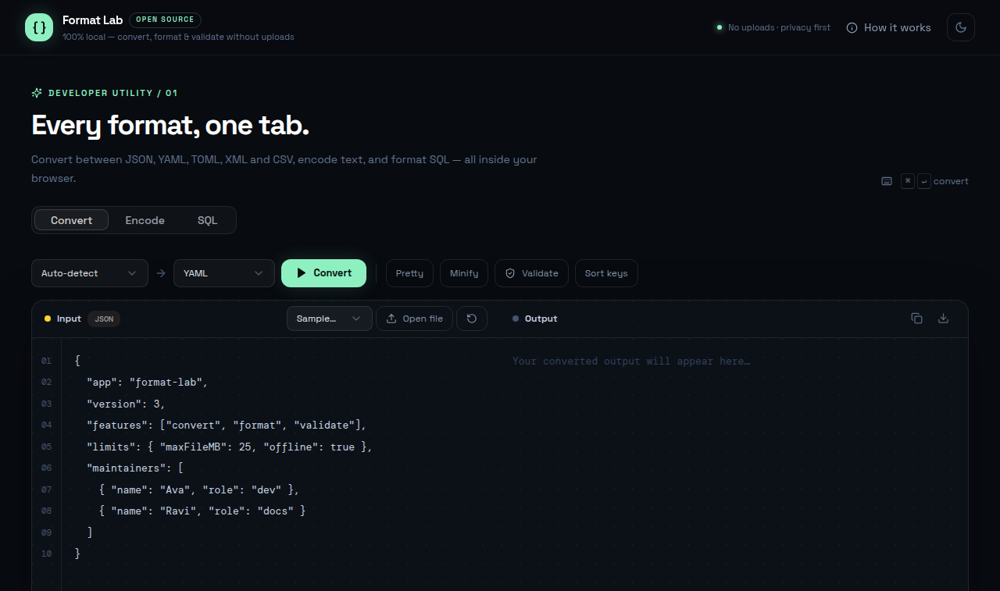
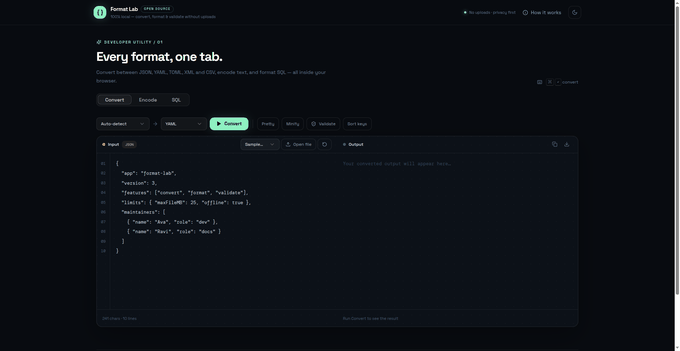

# 🧪 Format Lab

Universal **local-first** format converter, formatter & validator — convert between JSON, YAML, TOML, XML and CSV, encode text, and format SQL. Everything runs in your browser; nothing is ever uploaded.

**Live demo:** https://devilking7x.github.io/format-lab/

## ✨ Features

- **Convert** between JSON ↔ YAML ↔ TOML ↔ XML ↔ CSV with smart auto-detection
- **Pretty / Minify / Sort keys** for JSON
- **Validate** any supported format with friendly, pinpointed errors (JSON shows `...<here>...` snippets)
- **Encode tab** — Base64 and URL encoding/decoding, Unicode-safe, both directions
- **SQL tab** — keyword uppercasing, clauses on new lines, indented conditions
- **File import** — drop a `.json`, `.yaml`, `.toml`, `.xml`, `.csv` or `.sql` file (stays in your tab)
- **Copy & download** results, sample data for every format, `⌘/Ctrl+Enter` shortcut


### ❤️ Bada Dil, Chhoti Madad
Ye tool free hai aur hamesha free rahega. Agar isne tumhara time ya paisa bachaya ho, to ek Star ⭐ de do.
[⭐ Star this repo](https://github.com/devilking7x/format-lab)

## 🔁 Supported conversions

| From ↓ / To → | JSON | YAML | TOML | XML | CSV |
|---|---|---|---|---|---|
| **JSON** | ✅ | ✅ | ✅ | ✅ | ✅ |
| **YAML** | ✅ | ✅ | ✅ | ✅ | ✅ |
| **TOML** | ✅ | ✅ | ✅ | ✅ | ✅ |
| **XML** | ✅ | ✅ | ✅ | ✅ | ✅ |
| **CSV** | ✅ | ✅ | ✅ | ✅ | ✅ |
| **SQL** | ➖ output-only (use the SQL tab to format) |

Notes:
- XML attributes become `@name`, text nodes become `#text`, repeated tags become arrays.
- CSV auto-detects `,` / `;` / tab delimiters and handles quoted fields.
- TOML output needs a top-level object (`[[sections]]` for arrays of objects).

## 🚀 Quick Start

```bash
pnpm install
pnpm dev      # local dev server
pnpm build    # production build → dist/public
```

## 🔒 Privacy

Format Lab is 100% client-side. Your data never leaves the browser tab — no account, no API key, no tracking.

## 📸 Screenshots





## ❓ FAQ

**Is my file uploaded anywhere?**
No. Conversion, validation, and encoding all run locally in your browser.

**How large a file can it handle?**
Up to your browser's memory — files of several MB are usually fine. Very large files may get slow.

**Which conversions are supported?**
JSON ↔ YAML ↔ TOML ↔ XML ↔ CSV, plus Base64/URL encoding-decoding and a SQL formatter.

**What happens with invalid input?**
You get a friendly error message pointing at the exact problem location instead of a cryptic crash.

## 📄 License

MIT — see [LICENSE](LICENSE).
